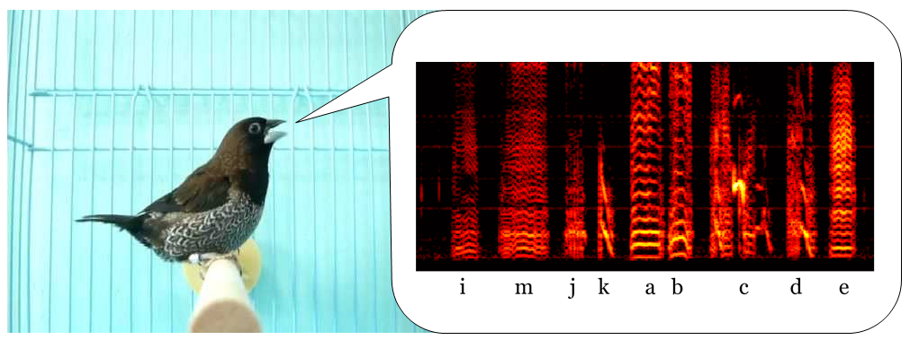

# hybrid-vocal-classifier
## a Python machine learning library for animal vocalizations and bioacoustics 

### Getting Started
You can install with pip: `$ pip install hybrid-vocal-classifier`  
For more detail, please see: https://hybrid-vocal-classifier.readthedocs.io/en/latest/install.html#install

To learn how to use `hybrid-vocal-classifier`, please see the documentation at:  
http://hybrid-vocal-classifier.readthedocs.io  
You can find a tutorial here: https://hybrid-vocal-classifier.readthedocs.io/en/latest/tutorial.html  
A more interactive tutorial in Jupyter notebooks is here:  
https://github.com/NickleDave/hybrid-vocal-classifier-tutorial  

### Project Information
the `hybrid-vocal-classifier` library (`hvc` for short) 
makes it easier for researchers studying
animal vocalizations and bioacoustics 
to apply machine learning algorithms to their data. 
The focus on automating the sort of annotations  
often used by researchers studying 
[vocal learning](https://www.sciencedirect.com/science/article/pii/S0896627319308396) 
sets `hvc` apart from more general software tools for bioacoustics.
 
In addition to automating annotation of data, 
`hvc` aims to make it easy for you to compare different models people have proposed,  
using the data you have in your lab,
 so you can see for yourself which one works best for your needs. 
A related goal is to help you figure out 
just how much data you have to label to get "good enough" accuracy for your analyses.
 
You can think of `hvc` as a high-level wrapper around 
the [`scikit-learn`](https://scikit-learn.org/stable/) library, 
plus built-in functionality for working with annotated animal sounds.

### Support
If you are having issues, please let us know.
- Issue Tracker: <https://github.com/NickleDave/hybrid-vocal-classifier/issues>

### Contribute
- Issue Tracker: <https://github.com/NickleDave/hybrid-vocal-classifier/issues>
- Source Code: <https://github.com/NickleDave/hybrid-vocal-classifier>

### CHANGELOG
You can see project history and work in progress in the [CHANGELOG](./doc/CHANGELOG.md)

### License
The project is licensed under the [BSD license](./LICENSE).

### Citation
If you use this library, please cite its DOI:  

### Backstory
`hvc` was originally developed in [the Sober lab](https://scholarblogs.emory.edu/soberlab/) 
as a tool to automate annotation of birdsong (as shown in the picture above). 
It grew out of a submission to the 
[SciPy 2016 conference](https://conference.scipy.org/proceedings/scipy2016/david_nicholson.html) 
and later developed into a library, 
as presented in this talk: https://youtu.be/BwNeVNou9-s
